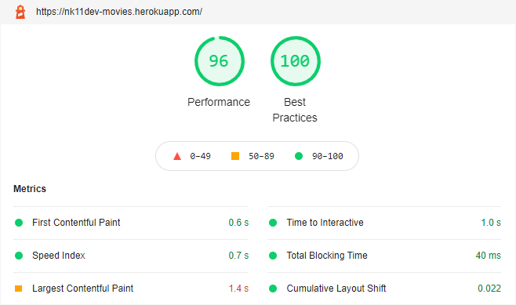

<p align="center">
  <a href="#-what-is-it">What is it</a> •
  <a href="#-functionality">Functionality</a> •
  <a href="#-technologies">Technologies</a> •
  <a href="#-how-to-use">How to use</a> •
  <a href="#-details">Details</a> •
  <a href="#-roadmap">Roadmap</a> •
  <a href="#-about">About</a>
</p>

<p align="center">
  <a href="https://github.com/nk11dev/movies/actions?query=workflow%3Ae2e-tests">
    
  </a>
  <a href="https://stats.uptimerobot.com/qLDMxHOKQy">
    
</a>
</p>

## 💡 What is it
Movies is a real world isomorphic React application. **It's fast, responsive, with i18n and SSR built in support.**

Movies application utilizes real movies data API provided by [The Movie Database (TMDb)](https://www.themoviedb.org/). 

📄 **Note:** If you have some issues fetching data from TMDb, like in Russia (it is maybe due to country access restriction), you can try to enable some VPN extension in your browser or use Cloudflare DNS.

#### 🏄 Demo: [nk11dev-movies.herokuapp.com](https://nk11dev-movies.herokuapp.com/)


## 🎥 Functionality
- Filter movies by category: "Now playing", "Popular", "Top rated" and "Upcoming"
- Search movies
- Switch localizations
- Watch movie details (including trailer, actors and images)
- Watch recommendations

## 🚀 Technologies
- [Webpack 5](https://webpack.js.org/blog/2020-10-10-webpack-5-release/)
- [ESLint](https://eslint.org/) (based on [eslint-plugin-import](https://www.npmjs.com/package/eslint-plugin-import), [eslint-plugin-react](https://www.npmjs.com/package/eslint-plugin-react), [eslint-config-airbnb-base](https://www.npmjs.com/package/eslint-config-airbnb-base) + some customizations)
- [Cypress](https://www.cypress.io/) (E2E testing)
- [Express](https://www.npmjs.com/package/express) (with client-side rendering / server-side rendering support)
- [React 17](https://ru.reactjs.org/)
- [Redux](https://redux.js.org/) + [Sagas](https://redux-saga.js.org/)
- [React Router 5](https://reactrouter.com/)
- [React-i18next](https://react.i18next.com/) (for multi language support)
- Hot Module Replacement  ([react-hot-loader](https://www.npmjs.com/package/react-hot-loader), [webpack-dev-server](https://www.npmjs.com/package/webpack-dev-server) and [nodemon-webpack-plugin](https://www.npmjs.com/package/nodemon-webpack-plugin) with server-side HMR and sagas HMR support)
- [Sass](https://www.npmjs.com/package/sass), [CSS Modules](https://github.com/css-modules/css-modules), [Bootstrap 4.6](https://getbootstrap.com/docs/4.6/getting-started/introduction/) + [Font Awesome 5](https://fontawesome.com/)

## 📖 How to use

### Environment variables

There are some environment variables with default values stored in `/configs/env/.env.defaults`.

<details> 
  <summary>Variables list</summary>
<br />

**Required** (they haven't default values)

For fetching movies data you should register account at [TMDb](https://www.themoviedb.org/signup) and use your own [API Read Access Token](https://developers.themoviedb.org/3/getting-started/authentication#bearer-token) or [API key](https://developers.themoviedb.org/3/getting-started/authentication#api-key).

| Variable         | Description                                                      
| ---------------- |------------------ |
| `TMDB_API_ACCESS_TOKEN` | *TMDb API Read Access Token* value (authentication by Bearer Token in `Authorization` header). Also, for this type of authentication you should set env variable `TMDB_API_V4_AUTHENTICATION=1` (default value) |

or

| Variable         | Description                                                      
| ---------------- |------------------ |
| `TMDB_API_KEY` | *TMDb API key* value (authentication by `api_key` query string parameter). Also, for this type of authentication you should set env variable `TMDB_API_V4_AUTHENTICATION=0` |

Steps for getting TMDb API to work in app:
1) Create `.env` file at the root folder (example of `.env` file you could find in `/configs/env/.env.defaults`).
2) Put in env variables with values depends on authentication method that you choose.

For example, your `.env` file should look like so (if you want to authenticate by *TMDb API Read Access Token*):
```
TMDB_API_ACCESS_TOKEN=put_your_api_access_token_here
TMDB_API_V4_AUTHENTICATION=1
```
or so (if you want to authenticate by *TMDb API key*):
```
TMDB_API_KEY=put_your_api_key_here
TMDB_API_V4_AUTHENTICATION=0
```

**Not required** (they have default values)

| Variable         | Default value      | Description                                                      
| ---------------- | ------------------ |------------------ |
| `TMDB_API_V4_AUTHENTICATION` | `1` | Flag for using [TMDb API v4 authentication method](https://developers.themoviedb.org/4/getting-started/authorization). Available values: `0` or `1`. Set it to `0` and add `TMDB_API_KEY` env variable if you want to use [TMDb API key](https://developers.themoviedb.org/3/getting-started/authentication#api-key) authentication instead of [TMDb API Read Access Token](https://developers.themoviedb.org/3/getting-started/authentication#bearer-token).|
| `TMDB_API_HOST` | `https://api.tmdb.org/3` | TMDb API host address. |
| `TMDB_API_REGION` | `US` | TMDb API region parameter will act as a filter to search for and display matching release date information. This parameter is expected to be an [ISO-3166-1](https://en.wikipedia.org/wiki/ISO_3166-1_alpha-2) code.|
| `PORT_CLIENT` | `8080` | Port used by `webpack-dev-server` for client-side development mode. |
| `PORT_SERVER` | `8081` | Port used by `express` for server-side development or production modes. |
| `RENDERING` | `client` | Application rendering type. Available values: `client` or `server`. |
| `DEBUG_MODE` | `1` | Debug mode. Available values: `0` or `1`. Enables Express logs with `morgan` logger and Redux logs with `redux-logger`. |
</details>

### NPM scripts

<details> 
  <summary>Installation</summary>

<br />

**Command**: `npm install`

Install dependencies via npm.

> **Note**: if you want to fetch data from TMDb API, you should set up required [environment variables](#environment-variables).

---

</details>

<details> 
  <summary>Development</summary>

<br />

**Command**: `npm run dev:client` or shorthand `npm run dev`

Run client-side React app by `webpack-dev-server` with HMR *(by default available at [localhost:8080](http://localhost:8080))*. 
> **Note**: If your changes affects only client-side, running this script will be enough for you.

<br />

**Command**: `npm run dev:server`

Run server-side Express app by `nodemon-webpack-plugin` to host `/dist/client/` folder *(by default available at [localhost:8081](http://localhost:8081))*. 
> **Note**: This script useful if you want to change server-side behavior or work with client-side as Express-hosted app.

---

</details>

<details> 
  <summary>Production</summary>

<br />

**Command**: `npm run build`

Build client and server for production.

<br />

**Command**: `npm start`

Run bundled Express server for hosting `/dist/client/` folder.

---

</details>

<details> 
  <summary>Testing</summary>

<br />

**Command**: `npm run cypress`

Open Cypress test runner.

<br />

**Command**: `npm run cypress:run`

Run Cypress tests to completion.

<br />

**Command**: `npm test`

Start `webpack-dev-server`, wait for a url to respond, then run Cypress tests. When the test process exits, shut down `webpack-dev-server`.

---

</details>

<details> 
  <summary>Linting</summary>

<br />

**Command**: `npm run lint`

Run ESLint with `./**` search pattern.

<br />

**Command**: `npm run lint:fix`

Run ESLint with `--fix` flag.

</details>

## 💻 Details

<details> 
<summary> Optimization </summary>

##### Current score:
> **Note**: Tested with disabled cache and extensions in Chrome Browser (Chrome -> Dev Tools -> "Lighthowse" tab).



Desktop version scores ~96/100 ponts.<br />
Mobile version scores ~82/100 ponts.

But there is a some planned improvements.
And that's without even mentioning the possible PWA techniques!

##### Express
  - [x] HTTP headers with Cache-Control

##### Bundle
  - [x] Minification
  - [x] Gzipping
  - [ ] Tree-shaking
  - [ ] Code-splitting

##### Fonts
  - [x] Stored locally
  - [x] In modern format
  - [x] Preloaded
  - [x] With "font-display:swap"

##### Images
  - [x] Lazy loading
</details> 

## 🐾 Roadmap
- [ ] QA: write more e2e tests, add unit tests (Jest);
- [ ] CI/CD: add docker images as isolated environment for application running and testing;
- [ ] Technologies: static type checking (Typescript), authorization (Firebase);
- [ ] Application features: users wishlist, genres filter;

🎓 Article: step by step tutorial with best practices about "How to code application like this".

## ✌️ About
**Author**: [nk11dev](https://github.com/nk11dev)<br />
**License**: [MIT](/LICENSE)

This product uses the TMDb API but is not endorsed or certified by TMDb.

[](https://www.themoviedb.org/)