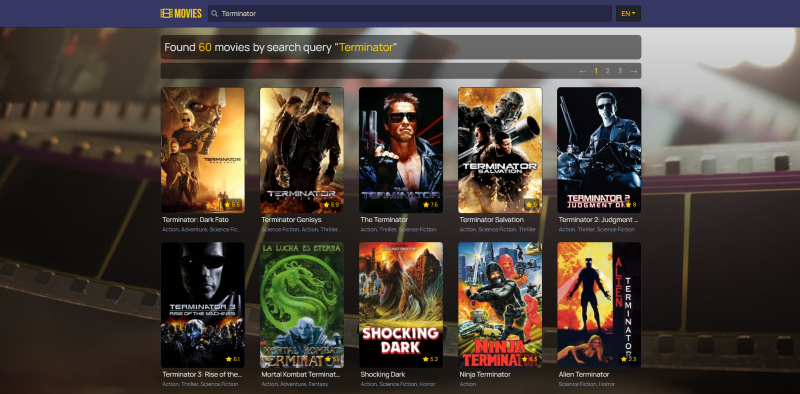
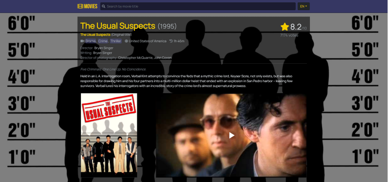
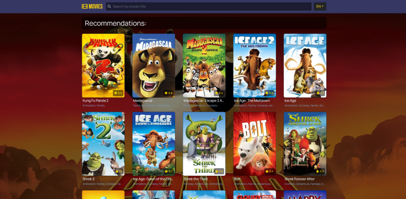
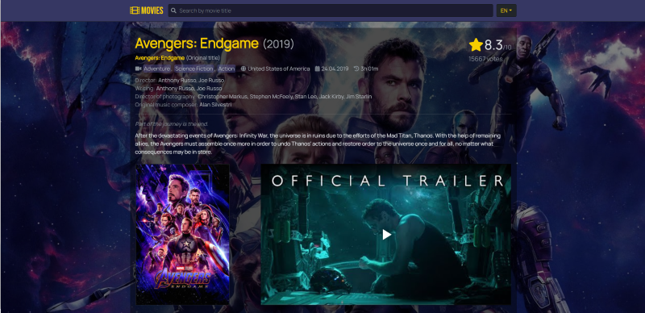

## Application for movies search, based on Webpack 4 / Express / React + Redux-Saga / SSR


Live demo is available at [nk11dev-movies.herokuapp.com](https://nk11dev-movies.herokuapp.com/)

## List of contents

- [Technology stack](#Technology-stack)
- [Description](#Description)
- [NPM scripts](#NPM-scripts)
- [Environment variables](#Environment-variables)
- [Roadmap](#Roadmap)

## Technology stack
- 🏄 Babel 7
- 🎁 Webpack 4
- 📐 ESLint 7 (based on "eslint-plugin-import", "eslint-plugin-react", "eslint-config-airbnb-base" + some customizations)
- 🚀 Server Side Rendering / Client Side Rendering with Express
- ⚡ Hot Module Replacement  (supports server-side and sagas)
- ✔️ React 16.x (latest), with Hooks
- ✔️ Redux + Sagas
- ✔️ React Router 4
- ✔️ React i18next for multi language support
- 🍦️ SASS, Bootstrap 4 + Fontawesome 5

## Description
Application based on custom webpack boilerplate with the latest dependency versions an uses real data API provided by The Movie Database (TMDb).

*Notation: if you want to clone this app and use it by yourself, you should register account at TMDb and use your own API key.* 

### Features: 
##### 🎥 watch movies lists, filtered by categories: "Now playing", "Popular", "Top rated" and "Upcoming". Pagination is supported.
*Example: "Top rated"m page 1 list for russian region*:


##### 🎥 search movies by title
*Example: Found 60 movies by search query"Terminator":*


##### 🎥 watch movie details
*Example: Movie details for "The Usual Suspects" (1995):*
- original title, genres, production countries, release date, duration
- creators: director, writing, director of photography, original music composer, actors
- movie rating based on TMDb users votes
- tagline and overview
- poster
- YouTube trailer 



##### 🎥 watch image gallery:
*Example: Image gallary for "Kill Bill: Vol. 1" (2003):*


##### 🎥 watch recommendations - list of similar movies:
*Example: Recommendation for "Kung Fu Panda" (2008):*

    
##### 🎥 switch localizations:

EN (English) and RU (Russian) languages are available. 
With locale changing also changes movie displayed data (in relation with selected language): title, tagline, description, poster, videos.
*Example: English localization for "Avengers: Endgame" (2019):*

*Example: Russian localization for "Avengers: Endgame" (2019):*


## NPM scripts
##### Installation
- `npm install`

Notation: for getting API to work you should create `.env` file at the root folder and put in `TMDB_API_KEY` variable with your TMDb API key as value.
Example of `.env` file you could find in `/configs/.env.defaults` file.
```yaml
TMDB_API_KEY=put_your_api_key_here
TMDB_API_HOST=https://api.themoviedb.org/3
TMDB_API_REGION=RU
PORT_CLIENT=8080
PORT_SERVER=8081
RENDERING=client
```


##### Development mode
- `npm run dev:client` (`npm run dev`) - launch client-side webpack-dev-server with HMR *(by default available on [localhost:8080](http://localhost:8080))*
- `npm run dev:server` - launch server-side nodemon for hosting `/dist/client/` folder *(by default available on [localhost:8081](http://localhost:8081))*

##### Production mode
- `npm run build` - build client and server for production
- `npm start` - launch builded express server for hosting `/dist/client/` folder 

##### Other
- `npm run lint` - run eslint with `./**` search pattern 
- `npm run lint:fix` - run eslint with `--fix` flag

## Environment variables

There is some environment variables with default values stored in `/configs/.env.defaults`

| Variable         | Default            | Description                                                      
| ---------------- | ------------------ |------------------ |
| `TMDB_API_KEY` | none | Your TMDb API key, used by internal module `ApiService.js` for fetching movies data |
| `TMDB_API_HOST` | https://api.themoviedb.org/3 | TMDb v3 API host, used by internal module `ApiService.js` for fetching movies data |
| `TMDB_API_REGION` | RU | TMDb API region paramater will act as a filter to search for and display matching release date information. This parameter is expected to be an [ISO-3166-1](https://en.wikipedia.org/wiki/ISO_3166-1_alpha-2) code.|
| `PORT_CLIENT` | `8080` | Port used by webpack-dev-server with client build |
| `PORT_SERVER` | `8081` | Port used by express for nodemon/production modes |
| `RENDERING` | `client` | Application rendering type. Available values: `client` or `server` |

## Roadmap
- 🔲 qa: tests
- 🔲 ci-cd: github actions for CI/CD with Heroku
- 🔲 ci-cd: build flags for github repo
- 🔲 ci-cd: keep-alive cron for Heroku
- 🔲 tech: flow static type checking
- 🔲 tech: firebase authorization
- 💥 and most important thing: series of articles with how to code this application tutorial and how it works in details