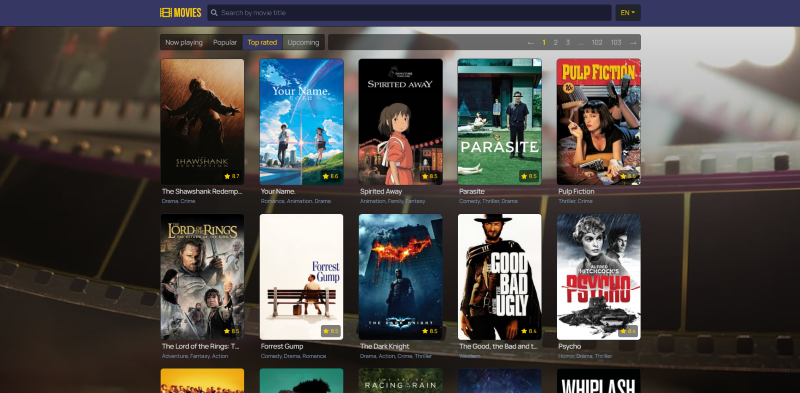

# Movies
## Application for movies search, based on Webpack 4 / Express / React + Redux-Saga / SSR


Live demo is available at [nk11dev-movies.herokuapp.com](https://nk11dev-movies.herokuapp.com/)

## List of contents

- [Description](#Description)
- [Technology stack](#Technology-stack)
- [NPM scripts](#NPM-scripts)
- [Environment variables](#Environment-variables)
- [Roadmap](#Roadmap)

## Description
Application based on custom webpack boilerplate with latest dependency versions. Application uses real data API provided by The Movie Database (TMDb). 

*Notation: if you want to clone this app and use it by yourself, you should register account at TMDb and use your own API key.* 

Application features: 
- 🎥 watch movies lists, filtered by categories: "Now playing", "Popular", "Top rated" and "Upcoming". Pagination is supported.

- 🎥 search movies by title

- 🎥 watch movie details:
    - original title, genres, production countries, duration
    - creators: director, wriring, director of photography, original music composer, actors
    - movie rating based on TMDb users votes
    - tagline and overview
    - poster
    - youtube trailer 


    - image gallery


    - recommendations - list of similar movies

    
- 🎥 localization is supported: EN (english) and RU (russian) languages are available. With locale changing also changes movie displayed data (in relation with selected language): title, tagline, description, poster, videos.

## Technology stack

- Build
    - 🏄 Babel 7
    - 🎁 Webpack 4
    - 🚀 Server Side Rendering / Client Side Rendering с Express
    - ⚡ Hot Module Replacement  (supports server-side and sagas)

- Main libraries and dependencies
  - ✔️ React 16.x (latest)
  - ✔️ Redux + Sagas
  - ✔️ React Router 4
  - ✔️ React i18next
  - 🍦️ Bootstrap 4 + Fontawesome 5

## NPM scripts
##### Installation
- `npm install`

Notation: for getting API to work you should create `.env` file at the root folder and put in `TMDB_API_KEY` variable with your TMDb API key as value.
Example of `.env` file you could find in `/configs/defaults/.env.defaults` file.
```yaml
TMDB_API_KEY=put_your_api_key_here
PORT_CLIENT=8080
PORT_SERVER=8081
RENDERING=client
```


##### Development mode
- `npm run dev-client` - launch client-side webpack-dev-server with HMR *(by default available on [localhost:8080](http://localhost:8080))*
- `npm run dev-server` - launch server-side nodemon for hosting `/dist/client/` folder *(by default available on [localhost:8081](http://localhost:8081))*

##### Production mode
- `npm run build` - build client and server for production
- `npm start` - launch builded express server for hosting `/dist/client/` folder 

## Environment variables

There is some environment variables with default values stored in `/configs/defaults/.env.defaults`

| Variable         | Default            | Description                                                      
| ---------------- | ------------------ |------------------ |
| `TMDB_API_KEY` | none | Your TMDb API key, used by internal module `ApiService.js` for fetching movies data |
| `PORT_CLIENT` | `8080` | Port used by webpack-dev-server with client build |
| `PORT_SERVER` | `8081` | Port used by express for nodemon/production modes |
| `RENDERING` | `client` | Application rendering type. Available values: `client` or `server` |

## Roadmap
- ✅ live  demo on Heroku
- 🐾 bugfixes
- 🔲 qa: tests
- 🔲 ci-cd: github actions for CI/CD with Heroku
- 🔲 ci-cd: build flags for github repo
- 🔲 ci-cd: keep-alive cron for Heroku
- 🔲 qa: linting
- 🔲 refactoring: move layout component outside of application routing (to prevent rudundant rerenders)
- 🔲 refactoring: more readable internal aliases with "@" symbol naming
- 🔲 refactoring: scss variables auto import
- 🔲 refactoring: styles isolation
- 🔲 tech: flow static type checking
- 🔲 tech: firebase authorization
- 💥 and most important thing: series of articles with how to code this application tutorial and how it works in details
